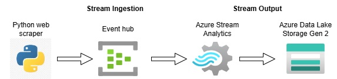

# Real-Time Weather Data Azure Stream Analytics Project
## Introduction
This is an Azure Stream Analytics project that ingests real-time weather data from a python web scraper and outputs the data to Azure storage. The python web scraper application extracts weather information from the web and outputs the data to Azure Event Hub. Azure Event Hub in turn sends this data to Azure Stream Analytics as an input stream. Azure Stream Analytics uses a T-SQL query to select the data from the input stream and to write it to an output stream. In this case the output stream is Azure Data Lake Syorage Gen 2.

## Architecture

## Technology Used
1. Programming language - Python
2. Azure Cloud Platform
   * Azure Event Hubs
   * Azure Stream Analytics
   * Azure Data Lake Storage Gen 2

## Data Source
Weather data scraped from free weather website:
URL: https://weather.com/weather/today/l/USNY0996:1:US

## Scripts for Project
[Web scraper script](WeatherScraper.py)
